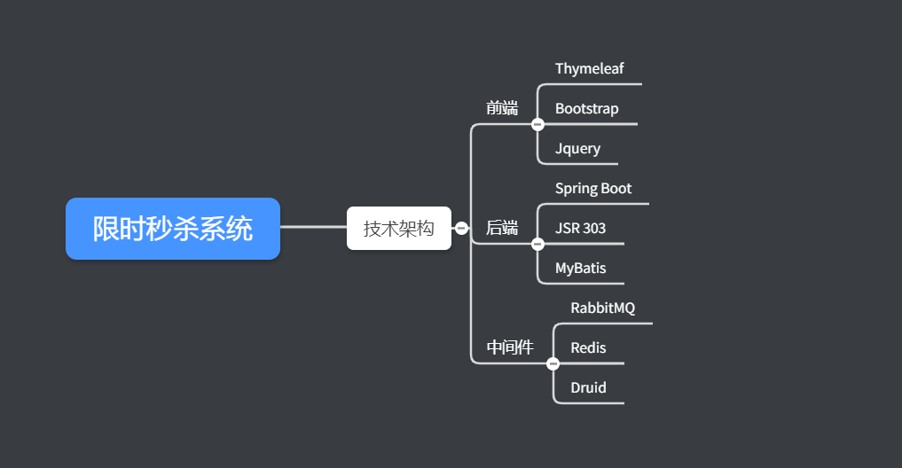
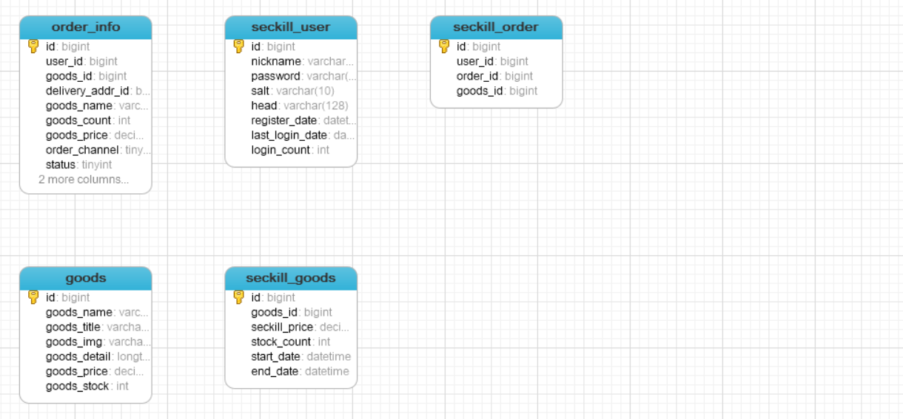
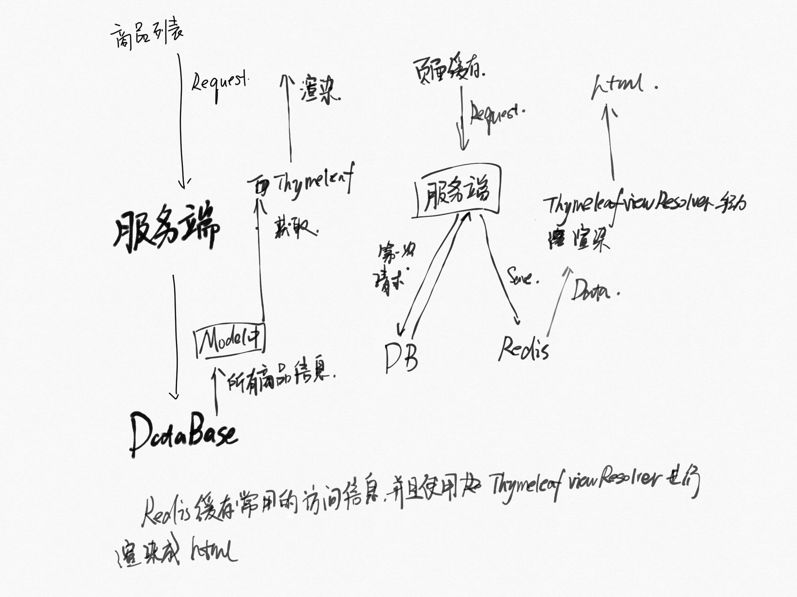

# 秒杀系统的设计

## 项目简介

项目模仿高并发情况下对于商品的秒杀， 以及对于并发情况下的秒杀做了一定的优化。

### 项目技术

### 快速启动

> 克隆仓库

` git clone https://github.com/JamesZhanp/seckill `

> 打开项目，下载maven的资源

` mvn clean package`

> 打开服务器的redis以及rabbitmq， 将sql文件导入数据库

> 启动服务

## 数据库设计

数据库主要有五张数据表

- order_info: 订单详情
- seckill_user: 参与秒杀的用户
- seckill_order:  秒杀订单
- goods： 物品详情
- seckill_goods: 参与秒杀的物品详情信息

## 登录实现

### 采用技术

-  密码明文使用俩次md5加密
- JSR303参数校验和全局异常处理
- 分布式session

### 明文密码两次MD5加密

- 客户端： C_PASS= MD5（铭文+固定salt）
- 服务端： S_PASS = MD5（C_PASS+随机salt）

加密： 处于安全考虑

第一次： 在前端加密，密码加密是生成md5用于传输，目的，http传输过程中为明文传输，容易被直接截取获取用户信息。加salt等操作就是为了避免出现网络上直接传输明文的过程

第二次： 避免因为出现数据库被黑掉，通过md5进行反向查询获取用户的信息。

### JSR303参数校验和全局异常处理

JSR303是一套对于JavaBean参数校验的标准， 定义了很多常用的校验注解。如 `@NotNull`, `@Email`等。我们自定义了一个`@IsMobile` 注解用来校验是否为手机号码, 其校验器为`IsMobileValidator` ，同时定义了一个全局异常`GlobalException`和全局异常处理器`GlobalExceptionHandler`,完成全局异常的捕获和异常的同意处理。

### 分布式session

在用户登录成功之后，将用户信息存储到redis中，然后生成token返回给客户端，这个token为存储在redis中的用户信息的key值，这样当用户第二次访问客户端时会携带token，首先到redis中获取查询该token对应的用户是否存在，不用每次去数据库中查询，减轻了数据库的访问压力

 ## 页面结束优化   

- 页面缓存+URL缓存+对象缓存
- 页面静态化， 前后端分离
- 静态资源优化
- CDN优化

### 页面缓存+URL缓存+对象缓存

**页面缓存**： 对于服务端的请求，不直接从系统中获取页面资源，耳式先从缓存中获取页面资源，如果缓存中不存在页面资源，则系统将渲染页面并且存储到缓存中，然后将页面返回。

