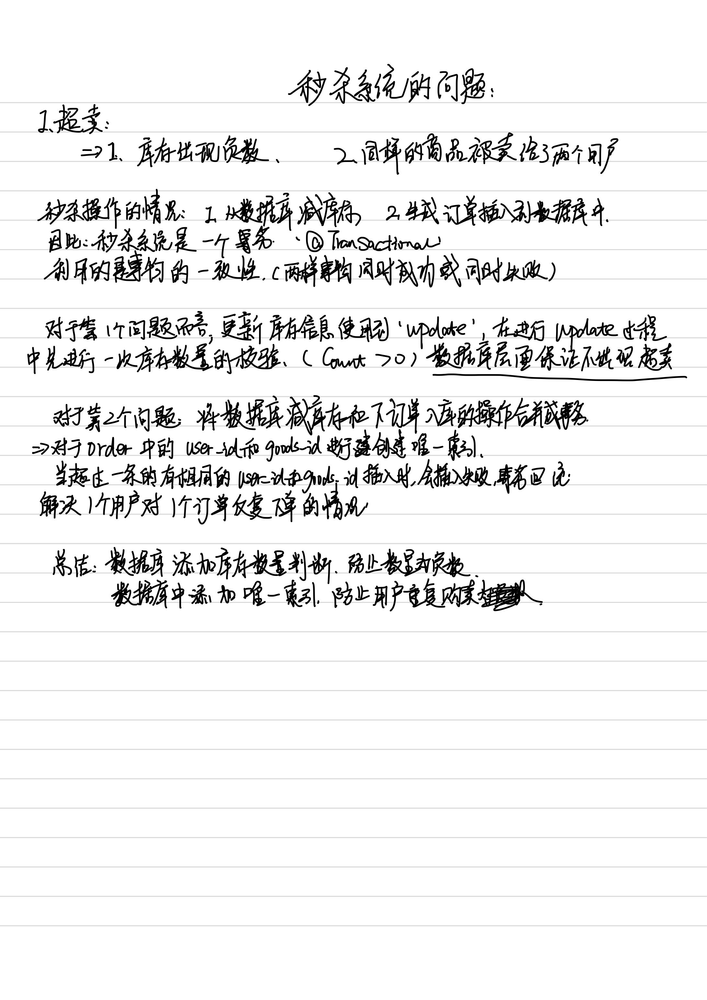

# 秒杀系统的设计

原项目地址： https://github.com/Grootzz/seckill 

## 项目简介

项目模仿高并发情况下对于商品的秒杀， 以及对于并发情况下的秒杀做了一定的优化。

### 项目技术

### 快速启动

> 克隆仓库

` git clone https://github.com/JamesZhanp/seckill `

> 打开项目，下载maven的资源

` mvn clean package`

> 打开服务器的redis以及rabbitmq， 将sql文件导入数据库

> 启动服务

## 数据库设计

数据库主要有五张数据表

- order_info: 订单详情
- seckill_user: 参与秒杀的用户
- seckill_order:  秒杀订单
- goods： 物品详情
- seckill_goods: 参与秒杀的物品详情信息

## 登录实现

### 采用技术

-  密码明文使用俩次md5加密
- JSR303参数校验和全局异常处理
- 分布式session

### 明文密码两次MD5加密

- 客户端： C_PASS= MD5（铭文+固定salt）
- 服务端： S_PASS = MD5（C_PASS+随机salt）

加密： 处于安全考虑

第一次： 在前端加密，密码加密是生成md5用于传输，目的，http传输过程中为明文传输，容易被直接截取获取用户信息。加salt等操作就是为了避免出现网络上直接传输明文的过程

第二次： 避免因为出现数据库被黑掉，通过md5进行反向查询获取用户的信息。

### JSR303参数校验和全局异常处理

JSR303是一套对于JavaBean参数校验的标准， 定义了很多常用的校验注解。如 `@NotNull`, `@Email`等。我们自定义了一个`@IsMobile` 注解用来校验是否为手机号码, 其校验器为`IsMobileValidator` ，同时定义了一个全局异常`GlobalException`和全局异常处理器`GlobalExceptionHandler`,完成全局异常的捕获和异常的同意处理。

### 分布式session

在用户登录成功之后，将用户信息存储到redis中，然后生成token返回给客户端，这个token为存储在redis中的用户信息的key值，这样当用户第二次访问客户端时会携带token，首先到redis中获取查询该token对应的用户是否存在，不用每次去数据库中查询，减轻了数据库的访问压力

 ## 页面结束优化   

- 页面缓存+URL缓存+对象缓存
- 页面静态化， 前后端分离
- 静态资源优化
- CDN优化

### 页面缓存+URL缓存+对象缓存

**页面缓存**： 对于服务端的请求，不直接从系统中获取页面资源，耳式先从缓存中获取页面资源，如果缓存中不存在页面资源，则系统将渲染页面并且存储到缓存中，然后将页面返回。

**URL缓存**：与页面缓存基本一直，对于商品列表存在详情页面，商品详情需要通过`goodsId`进行查询，因此对于商品详情信息按照goodsId为key保存在redis中

**对象缓存**: 是一种更细颗粒度的缓存，顾名思义就是对对象进行缓存，对于上述缓存内容若出现对于缓存内容的修改，首先删除缓存，之后插入需要更新的新的缓存。

### 页面静态化

页面静态化指的是直接将页面缓存到客户端，具体实现方式为使用`ajax`异步请求服务器获取动态数据，对于非动态数据缓存在客户端，客户端解析服务端的`json`数据进行渲染。

### 静态资源优化

- JS/CSS压缩，减少流量。客户端完成解压工作。
- 多个JS/CSS组合，减少连接数。一次TCP连接完成多个HTTP交互。
- CDN就近访问。

### CDN优化

CDN的全称是Content Delivery Network，即**内容分发网络**。CDN是构建在网络之上的内容分发网络，依靠部署在各地的边缘服务器，通过中心平台的负载均衡、内容分发、调度等功能模块，使用户就近获取所需内容，降低网络拥塞，提高用户访问响应速度和命中率。CDN的关键技术主要有内容存储和分发技术。

## 接口优化

- Redis预减库存减少数据库的访问
- 内存标记减少redis访问
- 请求先入队缓冲，异步下单，增强用户体验

### Redis预减库存减少数据库的访问

核心思想：减少对数据库的访问。

在做秒杀时，需要先查询数据库中的商品库存，确保逻辑正确，在本项目中，我们将库存信息信息存储在redis中，从而可以减少对数据库的访问。

**秒杀接口优化思路**：减少数据库的访问

- 系统初始化时，将商品库存信息加载到redis中；
- 服务端收到请求后，redis预减库存，如果库存不足，则直接进入下一步；
- 服务端将请求入队，立即返回向客户端返回排队中的信息，提高用户体验；
- 服务端请求出队，生成秒杀订单，减少库存；
- 客户端轮询是否秒杀成功。

### 内存标记减少redis访问

实际上，访问redis也是有网络开销的，所以，在本项目中使用内存标记减少对redis的访问。

具体实现为：

- 在`SeckillController`定义了一个`HashMap`，在某一商品已经秒杀结束时，在`HashMap`中对该商品的库存进行标记，如果库存为0，则将该商品标记为已经秒杀结束。然后在从redis中读取库存信息前做一次判断，如果该商品已经秒杀结束，则不用在访问redis中的库存信息。

### 请求先入队缓冲，异步下单，增强用户体验

服务器收到秒杀请求后，不是直接访问数据库，而是将请求放置在队列（RabbitMQ）中，这样可以提高用户体验。然后秒杀请求出队，服务器生成秒杀订单，减少缓存中的库存，这就是异步下单的过程。

具体的实现过程为：

- 如果秒杀商品库存尚有，则生成一条秒杀消息发送到消息队列中（信息中含有用户信息与商品id）；
- 消息的消费者收到秒杀消息后，从数据库中读取用户是否已经完成秒杀，如果没有，则减库存，下订单，写入订单信息到数据库中。

## 超卖问题

## 安全优化

- 隐藏接口地址
- 数学公式验证码
- 接口限流

### 隐藏接口地址

- 秒杀开始时，先去请求接口获取秒杀地址
- 接口改造， 带上`@pathVariable`参数
- 添加生成地址的接口
- 秒杀收到请求，先验证`@pathVariable`参数

在获取秒杀地址之前，首先向服务端发送`goodsId`和`verifyCode`， 服务端对验证码进行判断，如果正确，生成随机的秒杀地址，返回给客户端，客户端进行秒杀地址完整路径的封装，此使再次向服务端发起秒杀请求。

### 数学公式验证码

- 防止利用机器人等手段进行秒杀
- 降低短期内服务器的负载

### 接口限流

防止用户短期内多次访问增加服务器的眼里

**实现思路**：

在redis中存储一个用于记录访问次数的变量，在过期时间内被继续访问，则数量+1， 当时间过期之后，删除该变量

对于接口的防刷操作，定义方法拦截器`@AccessInterceptor`拦截用户对接口的请求，针对接口的请求的拦截，添加注解`@AccessLimit`即可。